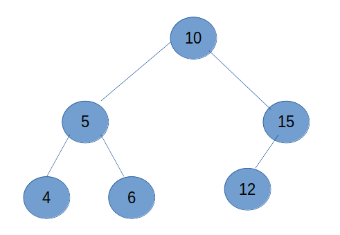

Trabalho 3 - Disciplina de Estrutura Pesquisa e Ordenação de Dados
-------------------------------
Curso de Graduação em Sistemas para Internet - UTFPR TD.

DESCRIÇÃO: Arquivo original [aqui](pdf/estruturaProva.pdf)

Estrutura, Pesquisa e Ordenação de Dados (TSI32B)

Professor: Ivan Luiz Salvadori

Prova

1) Quais são as diferenças entre alocação sequencial e alocação encadeada? Qual é o significado de contiguidade física? Quais as vantagens e desvantagens do uso de alocação sequencial e alocação encadeada? (Valor 1,0)

RESPOSTA: A diferença entre alocação sequencial e encadeada se da no endereço de armazenamento dos dados na memória. Na sequencial os dados são dispostos em endereços de memória vizinhos, em sequência, portando a localização do item seguinte corresponde a endereço atual + 1; e do anterior endereço atual - 1. Já na encadeada a alocação na memória pode não ser sequencial e por isso o dados possuem também um apontador para o endereço do próximo, criando uma conexão entre eles.
Contiguidade física significa que o proximo item estará no próximo endereço físico; no caso dos dados, o proximo dado estará no endereço de memória seguinte.
A alocação sequencial tem como vantagem o acesso direto ao item, através da posição e como desvantagem a exigencia que seu tamanho é fixo. Já na alocação sequencial o tamanho é dinâmico, porém há um custo maior de processamento para acessar um item, pois não ha acesso direto, é necessário percorer o encadeamento.

2) Argumente sobre buscas sequenciais e buscas binárias em estruturas de dados. Quais são os conceitos fundamentais destas duas estratégias de busca? Quais são os critérios e requisitos necessários para a realização dessas buscas? Quais estruturas de dados suportam buscas binárias? (Valor 1,0)

RESPOSTA: A busca sequencial consiste em percorrer todos os dados em sequencia e testar individualmente se ele é o desejado, ja na busca binária a cada iteração a estrutura é dividida logicamente em duas e testa-se se a qual das duas o item buscado pertence; o processo se repete até localizar o item.
Para que seja possivel utilizar uma busca binária a estrutura de dados precisa estar ordenada segundo algum critério. Para a busca se quencial a ordem é irrelevante pois os itens serão percorridos a partir do primeiro.
As estruturas de dados que suportam buscas binárias são as arvores binárias, que em java são implementadas com as classes TreeSet e TreeMap.

3) Qual é a motivação para utilizar Tabela Hash no armazenamento de informações em estruturas de dados sequenciais? O que é uma função hash e quais suas características fundamentais? Qual é o significado de colisão no contexto de tabelas hash? Como pode ser tratado o problema de colisões em tabelas hash? Argumente. (Valor 1,0)

RESPOSTA: O uso de Tabela Hash melhora o desempenho de busca de um dado, pois o acesso a um dado dessa estrutura é feito atráves de uma chave o que possibilita o acesso direto a posição onde se encontra o valor, independente de a estrutura estar ordenada ou não.
Uma função hash é uma função matematica que transforma um dado em um valor númerico que se encontra dentro da amplitude do tamanho da estrutura de dados, ela é empregada para definir a posição de um dado na Tabela Hash.
Uma colisão em uma tabela Hash acontece quando o resultado da função de hash para dois dados ter o mesmo valor, refletindo na inserção desses dados na mesma posição da Tabela Hash.
Para tratar as colisões é possível inserir o dado no proximo espaço vago ou expandir a dimensao da tabela Hash, permitindo-se inserir outra tabela dentro de cada posição.

4) Dada a seguinte árvore binária de busca: ( 10 ( 5 ( 4 ) ( 6 ) ) ( 15 ( 12) ) ), apresente a árvore correspondente em representação de grafo/genealógica. Além disso, apresente a ordem dos elementos quando aplicado os percursos em árvore: (a) pré-ordem, (b) ordem simétrica e (c) pós-ordem. (Valor 1,5)

RESPOSTA:

(a) pré-ordem: 10 5 4 6 15 12;
(b) ordem simétrica: 4 5 6 10 12 15;
(c) pós-ordem: 4 6 5 12 15 10.

5) A ideia básica do algoritmo de ordenação Merge Sort é criar uma sequência ordenada a partir de duas outras também ordenadas. Dito isso, é possível ordenar um único vetor de números inteiros utilizando o Merge Sort? Argumente! Com base na afirmação anterior, é possível utilizar o Merge Sort para ordenar um vetor de números inteiros cuja formação original não corresponde a duas fontes não ordenadas (vetor não ordenado). Argumente Descreva como o método de divisão e conquista é aplicado no algoritmo Merge Sort. (Valor 1,5)

RESPOSTA: É possivel utilizar o algoritimo Merge Sort para ordenar um único vetor, para isso é necessário que o vetor seja dividido em outros dois lógicamente; é possivel fazer isso indicando para o algoritimo que um vetor começa na primeira posição e termina na metade e o segundo inicia na metade + 1 e termina na ultima posição.
Para aplicar o algoritimo Merge Sort em dois vetores não ordenados pode-se dividi-los ao meio até que se atinjam dois vetores com apenas um elemento cada o que se caracteriza como dois vetores ordenados; com eles pode-se aplicar o Merge Sort que gera um novo vetor ordenado; a partir de então retorna-se um nível acima e com o vetor de dois elementos ordenados e o vetor resto da segregação deste nível aplica-se novamente o Merge Sort. Essas operações se repetem até que se retoceda em todos os níveis que foram necessários para fragmentar o vetor inicial em dois com apenas um elemento cada. 

--------------------------------------

6) O SS Kaiser Wilhelm der Grosse foi um navio de passageiros alemão operado pela Norddeutscher Lloyd e construído pela AG Vulcan Stettin em Estetino. Foi a primeira embarcação da Classe Kaiser de transatlânticos, sendo seguido pelo SS Kronprinz Wilhelm, SS Kaiser Wilhelm II e SS Kronprinzessin Cecilie. A sua viagem inaugural ocorreu em setembro de 1897. Para garantir segurança em percursos transatlânticos, é necessário distribuir adequadamente as bagagens dos passageiros. Conforme descrito na imagem abaixo, grande parte dos equipamentos, motores e demais mecanismos de funcionamento encontram-se na parte central do navio. Pode-se notar também que o bagageiro do navio estende-se por toda a área útil do navio. Sendo assim, as bagagens devem ser distribuídas adequadamente conforme o peso. As bagagens mais pesadas devem ser dispostas nas extremidades do navio. As bagagens mais leves devem ser dispostas no centro do navio. Escreva um programa Java capaz de distribuir corretamente as bagagens dos passageiros do SS Kaiser Wilhelm der Grosse conforme as especificações de segurança descritas anteriormente. (Valor 4,0)

A lista de bagagens está representada pelo arquivo bagagens.csv. A lista de bagagens está descrita pela ordem de despacho das bagagens. O programa deve ordenar as bagagens mais pesadas na extremidade e as bagagens mais leves no centro.

Para executar o release insira no terminal
``java -jar navio.jar``

Requer Java 11.0